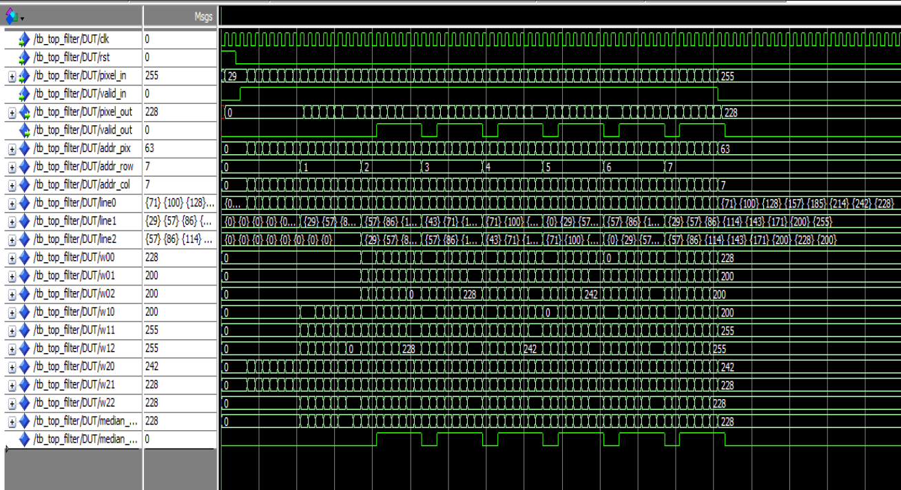
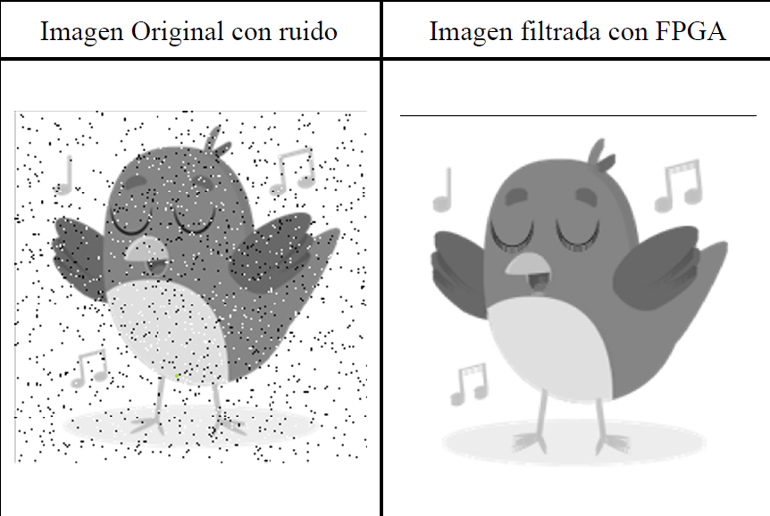

# Filtro de Mediana en Hardware (FPGA Altera DE2-115) para Reducción de Ruido Sal y Pimienta

Este repositorio contiene la arquitectura de hardware, simulación y verificación en circuito de un **acelerador para el procesamiento digital de imágenes en tiempo real** implementado en VHDL. El sistema ejecuta un **filtro de mediana no lineal con ventana deslizante de $3 \times 3$** utilizando la estrategia de procesamiento de bordes **Valid-Only**, diseñado específicamente para la eliminación de ruido impulsivo (*Sal y Pimienta*) en imágenes en escala de grises ($204 \times 204$ píxeles, 8 bits/píxel).

---

## Especificaciones Técnicas y Entorno de Desarrollo

* **Placa de Desarrollo:** Terasic DE2-115
* **Target FPGA:** Altera Cyclone IV E (`EP4CE115F29C7`)
* **Entornos de Software:** 
  * **Intel Quartus II / Prime Web Edition v13.0** (Síntesis, Place & Route, In-System Memory Content Editor)
  * **ModelSim / Quartus EDA Simulation** (Simulación funcional y análisis de formas de onda)
  * **MATLAB** (Generación de archivos `.mif`, adición de ruido y reconstrucción visual final)
* **Parámetros del Sistema:**
  * **Resolución de Imagen:** $204 \times 204$ píxeles ($41,616$ direcciones de memoria BRAM)
  * **Formato de Píxel:** 8 bits en escala de grises ($0 = \text{negro}$, $255 = \text{blanco}$)
  * **Frecuencia de Reloj:** $50\text{ MHz}$ (`CLK_50` - Periodo de $20\text{ ns}$)

---

## Arquitectura RTL y Flujo de Datos en Pipeline

A diferencia de un procesador secuencial, la FPGA procesa el flujo de datos (*stream processing*) mediante un pipeline concurrente. La ventana de $3 \times 3$ ($P_1$ a $P_9$) se construye continuamente a partir de la memoria mediante dos **Line Buffers** encadenados.

  
   
  <em>Figura 1: Simulación del timing y sincronización de señales en ModelSim.</em>

## Resultados y Simulación

Aquí se presentan las capturas de pantalla de las simulaciones temporales en ModelSim y los resultados del procesamiento de imagen (Original vs. Filtrada):

  
   
  <em>Figura 1: Simulación del timing y sincronización de señales en ModelSim.</em>

  
   
  <em>Figura 2: Comparativa de la imagen original y el resultado tras aplicar el filtro de ventana en FPGA.</em>

*(Asegúrate de ajustar las rutas de las imágenes en las etiquetas `` según tus carpetas).*

---

## Autoría y Créditos

Este proyecto fue desarrollado en el entorno académico como parte del trabajo de diseño digital avanzado en FPGA.

* **Autores:**
  * Erick Isaias Huallanca Perez
  * Po Cheng Chien Chang
* **Contribuciones Clave:**
  * Diseño de la arquitectura de hardware y búferes de línea.
  * Implementación y síntesis de la lógica en Intel Quartus.
  * Verificación mediante testbenches y análisis de timing en ModelSim.
